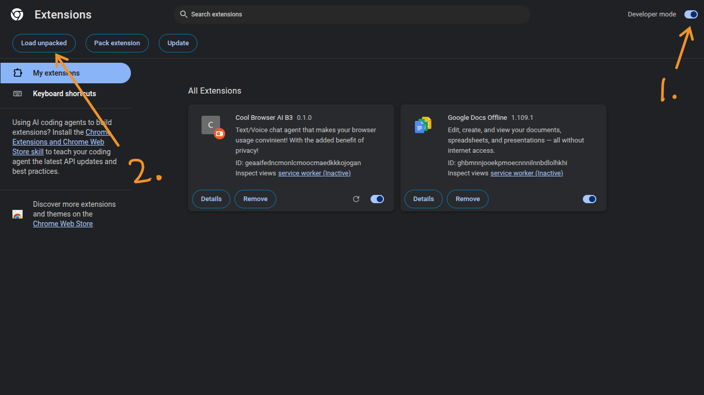

# README.MD
# Repo structure:

```
/ <- Root

/docs <- Documentation

/src <- Source code

```
## Steps too running this locally

1. Starting the Blur service 
### Use Python 3.11

```
   cd blur_service/
   pip install -r requirements.txt
   uvicorn blur_server:app --port 8788
```

2. Starting the reasoning server
### Add your own enviroment variable: export GEMINI_API_KEY=[GEMINI-API-KEY]
### This above methord is for linux^^ may be different for other Operating systems
### Get one at "https://aistudio.google.com/app/apikey"

```
   cd server/
   npm install
   npm start

```

3. Extension

Import the unpacked "extension/" folder into Chrome using developer mode



4. Use the extension

Go to a webpage like google.com or a search engine of your choice, do NOT start at the default chrome:// webpage as this extension cannot access that.